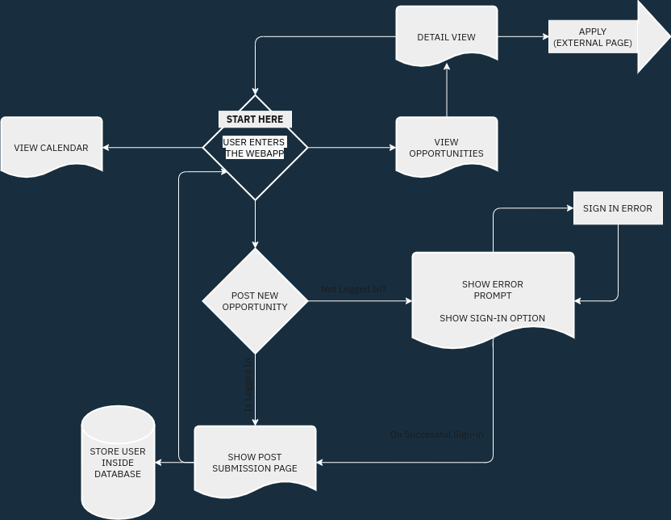

# Opportunity Calendar

> a webapp to lists opportunities available at different organisations and
> companies. Ideal for students who never want to miss any opportunities. This
> webapp is a modified version of
> [Girl-Code-It/Opportunity-Calendar](https://github.com/Girl-Code-It/Opportunity-Calendar-Frontend)

[Demo](https://opp-cal.vercel.app)

## Features

This webapp has multiple features. Following are some of the important ones.

- [x] Account Creation
- [x] Post new Opportunities
- [x] Anyone can view opportunities
- [x] Apply through the website
- [x] A digital calendar listing all the opportunities date-wise
- [ ] Save Opportunity as 'Favorite'
- [ ] Refer Applicants (via Girl Code It)

## Flow Chart

## Technologies Used

- [TypeScript](https://www.typescriptlang.org/)
- [React](https://reactjs.org)
- [Next.js](https://nextjs.org)
- [Subapase](https://supabase.io/)
- [PostgreSQL](https://www.postgresql.org/)

## License

MIT License

Copyright (c) 2021 Abdus

Permission is hereby granted, free of charge, to any person obtaining a copy
of this software and associated documentation files (the "Software"), to deal
in the Software without restriction, including without limitation the rights
to use, copy, modify, merge, publish, distribute, sublicense, and/or sell
copies of the Software, and to permit persons to whom the Software is
furnished to do so, subject to the following conditions:

The above copyright notice and this permission notice shall be included in all
copies or substantial portions of the Software.

THE SOFTWARE IS PROVIDED "AS IS", WITHOUT WARRANTY OF ANY KIND, EXPRESS OR
IMPLIED, INCLUDING BUT NOT LIMITED TO THE WARRANTIES OF MERCHANTABILITY,
FITNESS FOR A PARTICULAR PURPOSE AND NONINFRINGEMENT. IN NO EVENT SHALL THE
AUTHORS OR COPYRIGHT HOLDERS BE LIABLE FOR ANY CLAIM, DAMAGES OR OTHER
LIABILITY, WHETHER IN AN ACTION OF CONTRACT, TORT OR OTHERWISE, ARISING FROM,
OUT OF OR IN CONNECTION WITH THE SOFTWARE OR THE USE OR OTHER DEALINGS IN THE
SOFTWARE.
